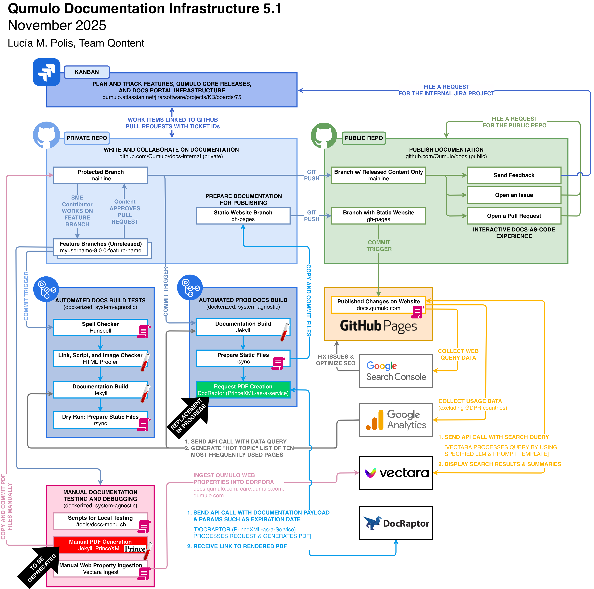

# Qumulo Documentation Portal
Welcome to the Qumulo Documentation Portal repository! This project uses docs-as-code principles to provide guidance about deploying, configuring, and working with cloud and on-premises Qumulo offerings, developer tools and interfaces, and external alerts and monitoring for Qumulo Core. 

**Table of Contents**
* [Repository Maintainers](#repository-maintainers)
* [Contributing to this Project](#contributing-to-this-project)
  * [🍊&thinsp;As a Qumulon](#as-a-qumulon)
* [Running Tests and Builds](#running-tests-and-builds)
  * [🍊&thinsp;As a Qumulon](#as-a-qumulon-1)
  * [How Automation Works in the `docs-internal` Repository](#how-automation-works-in-the-docs-internal-repository)
* [About This Project's Infrastructure](#about-this-projects-infrastructure)
* [Licenses](#licenses)

## Repository Maintainers
The current owner and primary maintainer of this repository is [🍊&thinsp;Lucía M. Polis](https://github.com/shefulloflight).

The secondary maintainers of this repository are:

* [🍊&thinsp;Andrew Abrahamowicz](https://github.com/andrewabrahamowicz)

* [🍊&thinsp;Martin Metke](https://github.com/mmetke-qumulo)

## Contributing to this Project
You can contribute content to this repository by sending feedback to this repository's maintainer or by opening a GitHub issue. Before you begin, familiarize yourself with our [Contributor Covenant Code of Conduct](CODE_OF_CONDUCT.md) and [Contributing Guidelines](CONTRIBUTING.md).

* [Send Feedback](https://qumulo.atlassian.net/jira/software/form/a3eaa618-84a6-47ec-8a9e-5a0c3b016bc5)

* [Open an Issue](https://github.com/Qumulo/docs/issues/new/choose)

### 🍊&thinsp;As a Qumulon
* Docs-as-Code Workflows

  * [🔒 Docs as Code Quick-Start Guide for Engineering Teams](https://qumulo.atlassian.net/wiki/spaces/QON/pages/2858385431/)

  * [🔒 Onboarding to the Docs-as-Code Process at Qumulo](https://qumulo.atlassian.net/wiki/spaces/QON/pages/1585774639/Contributing+to+Docs+as+Code#Onboarding-to-the-Docs-as-Code-Process-at-Qumulo)

  * [🔒 Best Practices for Working with Docs as Code](https://qumulo.atlassian.net/wiki/spaces/QON/pages/1755676699/)

* Working with Git and GitHub

  * [🔒 Working with the GitHub Web UI](https://qumulo.atlassian.net/wiki/spaces/QON/pages/1755185184/)

  * [🔒 Working with the Git CLI](https://qumulo.atlassian.net/wiki/spaces/QON/pages/1755643921/)

  * [🔒 Useful Git Commands](https://qumulo.atlassian.net/wiki/spaces/QON/pages/1755512871/)

* Contributing Content

  * [🔒 Preparing Hardware Platform Documentation](https://qumulo.atlassian.net/wiki/spaces/QON/pages/1942586089/)

  * [🔒 Preparing Release Notes](https://qumulo.atlassian.net/wiki/spaces/QON/pages/1817215088/)

  * [🔒 Preparing Collateral for a Qumulo Core Release](https://qumulo.atlassian.net/wiki/spaces/QON/pages/2976874578/)

  * [🔒 Publishing a Qumulo Core Release (Engineering)](https://qumulo.atlassian.net/wiki/spaces/EN/pages/765231733/)

  * [🔒 Style Guide for Technical Documentation](https://qumulo.atlassian.net/wiki/spaces/QON/pages/1814036510/)

    * [🔒 Preparing to Contribute Content](https://qumulo.atlassian.net/wiki/spaces/QON/pages/1813741669/)

    * [🔒 Structuring a Topic](https://qumulo.atlassian.net/wiki/spaces/QON/pages/1813610636/)
   
    * [🔒 Formatting Text and Ordering Information](https://qumulo.atlassian.net/wiki/spaces/QON/pages/1813741718/)

    * [🔒 Best Practices for Writing and Editing Technical Documentation](https://qumulo.atlassian.net/wiki/spaces/QON/pages/1814069393/)

## Running Tests and Builds
Everything you need to successfully test and build the documentation from the `docs-internal` repository is located in the `dm` tool, which you can run from [`./tools/docs-menu.sh`](tools/docs-menu.sh) for the first time.

### 🍊&thinsp;As a Qumulon
* [🔒 Building and Checking HTML Documentation](https://qumulo.atlassian.net/wiki/spaces/QON/pages/1755217988/)

* [🔒 Building the `qq` CLI and REST API Guides](https://qumulo.atlassian.net/wiki/spaces/QON/pages/2259550614/)

* [🔒 Building PDF Documentation](https://qumulo.atlassian.net/wiki/spaces/QON/pages/1841070245)

* [🔒 Preparing Collateral for a Qumulo Core Release](https://qumulo.atlassian.net/wiki/spaces/QON/pages/2976874578/)

* [🔒 Publishing a Qumulo Core Release (Engineering)](https://qumulo.atlassian.net/wiki/spaces/EN/pages/765231733/)

* [🔒 Documentation Runbooks](https://qumulo.atlassian.net/wiki/spaces/QON/pages/1953660967/)

### How Automation Works in the `docs-internal` Repository
* **Testing:** This repository runs the `.github/workflows/test.yml` workflow on every commit to the `docs-internal` repository.

* **Publishing:** When the repository owner merges a pull request to `mainline`, the `docs-internal` repository runs the `.github/workflows/publish.yml` workflow.

## Features and Functionality
This project began from [Jekyll Doc Theme 6.0](https://github.com/tomjoht/documentation-theme-jekyll) by [Tom Johnson](https://idratherbewriting.com/aboutme/) and received additional custom features and enhancements over time.

* User Experience and Feedback (JS and jQuery)
  * [Copy code to clipboard](js/copy-code.js)
  * [Favorite pages in browser local storage](js/list-favorites.js)
  * [Retrieval of page favorite status](js/check-favorites.js)
  * [Cookie consent banner](js/grt-cookie-consent.js) (adapted from [GRT Cookie Consent](https://grt107.github.io/grt-cookie-consent/))
  * [Modal pop-up for reporting documentation issues directly into a Jira backlog](js/send-feedback.js)
  * [RAG-driven search](js/vectara.js) from [Vectara](https://www.vectara.com/)
    * [Custom parametrized URLs with history states](js/search-specs.js)
* Layout and navigation ([Liquid Templating Language](https://shopify.github.io/liquid/))
  * [Breadcrumbs](_includes/crumb)
  * [Parent landing pages](_layouts/parent_landing_page.html)
  * [Child landing pages](_layouts/landing_page.html)
* Content creation (Python)
  * [Custom generation of REST API documentation from `openapi.json`](tools/gen-api.py)
    * Dynamic labeling of REST APIs with versions, **PREVIEW**, and **DEPRECATED** tags
  * 🔒 Custom generation of `qq` CLI documentation from the code base

## How This Project's Infrastructure is Organized
The following diagram outlines the most current project infrastructure.

## Licenses
This project uses the [Creative Commons Attribution 4.0 International](/LICENSE) overall and the [BSD 3-Clause License](/LICENSE-BSD-NAVGOCO) for the Navgoco jQuery component.

All content is Copyright &copy; Qumulo, Inc. except where specified otherwise.
