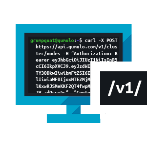

To get started, choose one of the following guides.

  
    <a class="multilink" href="azure-administrator-guide/">
      <picture>
        <source type="image/webp" srcset="images/azure-native-qumulo-administrator-guide.webp">
        <source type="image/png" srcset="images/azure-native-qumulo-administrator-guide.png">
        
      </picture> {{site.guides.anq}}</a>
  

  
    <a class="multilink" href="administrator-guide/">
      <picture>
        <source type="image/webp" srcset="images/on-premises-administrator-guide.webp">
        <source type="image/png" srcset="images/on-premises-administrator-guide.png">
        
      </picture> {{site.guides.onprem}}</a>
  

  
    <a class="multilink" href="hardware-guide/">
      <picture>
        <source type="image/webp" srcset="images/hardware-guide.webp" width="301" height="301">
        <source type="image/png" srcset="images/hardware-guide.png" width="301" height="301">
        
      </picture> {{site.guides.hard}}</a>
  

  
    <a class="multilink" href="qq-cli-command-guide/">
      <picture>
        <source type="image/webp" srcset="images/qumulo-qq-cli-command-guide.webp">
        <source type="image/png" srcset="images/qumulo-qq-cli-command-guide.png">
        
      </picture> {{site.guides.cli}}</a>
  

  
    <a class="multilink" href="rest-api-guide/">
      <picture>
        <source type="image/webp" srcset="images/qumulo-rest-api-guide.webp">
        <source type="image/png" srcset="images/qumulo-rest-api-guide.png">
        
      </picture> {{site.guides.rest}}</a>
  

  
    <a class="multilink" href="qumulo-alerts-guide/">
      <picture>
        <source type="image/webp" srcset="images/qumulo-alerts-guide.webp">
        <source type="image/png" srcset="images/qumulo-alerts-guide.png">
        
      </picture> {{site.guides.alert}}</a>
  

  
    <a class="multilink" href="integration-guide/">
      <picture>
        <source type="image/webp" srcset="images/qumulo-integration-guide.webp">
        <source type="image/png" srcset="images/qumulo-integration-guide.png">
        
      </picture> {{site.guides.integ}}</a>
  

## Hot Topics
The following are the most-accessed pages on the Documentation Portal.

1. [Configuring Round-Robin DNS on Windows Server for Qumulo Core](/administrator-guide/network-configuration/configuring-round-robin-dns-windows-server.html)
2. [Enabling Cloud-Based Monitoring and Remote Support](/administrator-guide/monitoring-and-metrics/enabling-cloud-based-monitoring-remote-support.html)
3. [Qumulo Core Feature Log](/administrator-guide/upgrading-qumulo-core/feature-log.html)
4. [Getting Started with the qq CLI](/administrator-guide/qq-cli/getting-started.html)
5. [Supported Configurations and Known Limits for Qumulo Core](/administrator-guide/getting-started/supported-configurations-known-limits.html)
6. [Managing Snapshots in Qumulo Core](/administrator-guide/snapshots/managing-snapshots.html)
7. [Performing Qumulo Core Upgrades](/administrator-guide/upgrading-qumulo-core/performing-upgrades.html)
8. [Creating and Managing S3 Buckets in Qumulo Core](/administrator-guide/s3-api/creating-managing-s3-buckets.html)
9. [How Drive and Node Failure Protection Works in Qumulo Core](/administrator-guide/node-addition-replacement/how-drive-node-failure-protection-works.html)
10. [Configuring and Using the S3 API in Qumulo Core](/administrator-guide/s3-api/configuring-using-s3-api.html)

## Get Qumulo Core
{{site.nexusDownloads}} {{site.loginRequired}}.

For information about upgrading, see:
* [Feature Log](/administrator-guide/upgrading-qumulo-core/feature-log.html)
* [Qumulo Core Upgrade Mode Reference](/administrator-guide/upgrading-qumulo-core/mode-reference.html)
* [Performing Instant Software Upgrades and Platform Upgrades](/administrator-guide/upgrading-qumulo-core/instant-software-platform.html)

For an introduction to the Qumulo API, see the [`qumulo-api-introduction` GitHub repository](https://github.com/Qumulo/qumulo-api-introduction).

## Collaborate
We're currently in process of migrating legacy articles about Qumulo Core and hardware platform functionality from [Qumulo Care](https://care.qumulo.com/s/knowledge).

## Reach Out to Us
If you need help, [open a case](https://care.qumulo.com/s/submit-a-case), or {{site.contactQumuloCare}} through Slack, email, or by phone.
