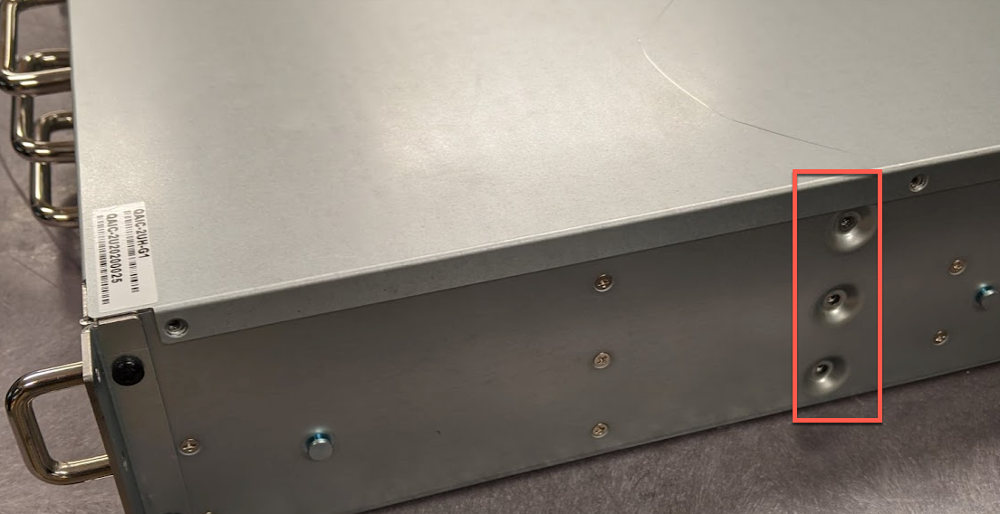
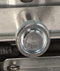

This section explains how you can replace the chassis in C-192T and C-432T nodes. 

## Prerequisites 
Before you begin, ensure that you have C-192T or C-432T hardware and the replacement chassis.

## Step 1: To Prepare for Chassis Replacement
**Note:** We strongly suggest having another person help you with this process.

1. To shut down the node, use the power button at the front or connect using SSH and run the `sudo shutdown -h now` command. 

1. Disconnect all cables from the back of the node.

1. To pull the node out from the rack, release the small, white tabs on the rails that hold the chassis in place.

1. Place the node on a flat surface.

1. To release the lid, remove the small screw on the upper-right side of the node (viewed from the rear).

1. Press the large **PUSH** button on each side of the chassis frame.

   

   The inner components of the node are exposed.

## Step 2: To Replace the M.2 Boot Drive, NVMe SSDs, and HDDs

1. Remove the internal M.2 boot drive and then transfer it into the replacement chassis Qumulo provided to you.

   

1. Remove the rear NVMe SSDs and then transfer them into the replacement chassis. The following is the mapping for the drives.

   <table>
     <tr>
       <td>6</td>
       <td>4</td>
       <td>2</td>
     </tr>
     <tr>
       <td>5</td>
       <td>3</td>
       <td>1</td>
     </tr>
   </table>

1. To allow the HDD trays to slide open, ensure that any shipping screws are removed from the replacement chassis.

   

1. Install the replacement chassis in an appropriate location in your server rack.

1. Starting with the top drawer, transfer the HDDs from each tray in the original chassis into a corresponding slot in the replacement chassis. For more information about drive locations, see [C-Series Drive Diagrams](https://care.qumulo.com/hc/en-us/articles/360020198853-Qumulo-C-Series-Drive-Diagrams) in Qumulo Care.

   **Important:** Work on one drawer at a time. If you apply 2 kg (or more) of downward force to a drawer, it might deform while opened.

   a. To open the HDD drawer, use the blue lever at the front of the node.

   b. To remove an HDD from the original chassis, gently lift up the drive tray knob. This lets the drive move forward and unlatch.

   
   
   c. To insert an HDD into the replacement chassis, gently slide the drive tray knob backwards. This latches the drive and knob in place.

1. Reconnect the power and networking cables to the node.

1. Power on the node.

## Step 3: (Optional) Reconfiguring the Out-of-Band Management (IPMI) Settings
If the current IPMI settings for your node are configured statically (rather than using DHCP), you must reapply the static IPMI settings to the replacement node. For more information, see [IPMI Quick Reference Guide for Qumulo C-Series](https://care.qumulo.com/hc/en-us/articles/360024426314-IPMI-Quick-Reference-Guide-for-Qumulo-C-Series) in Qumulo Care.
