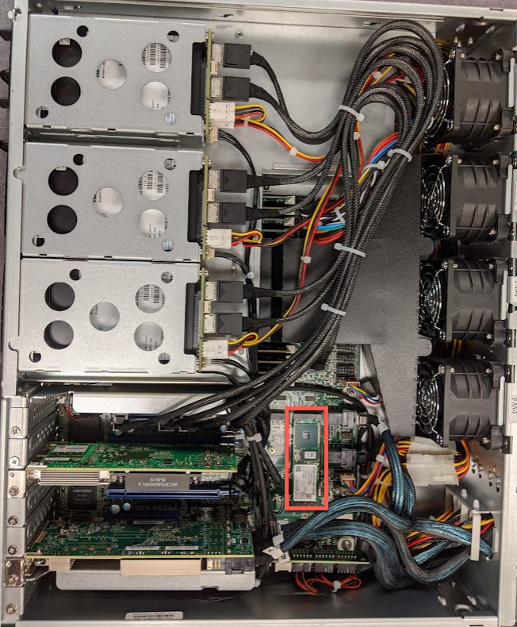
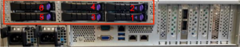
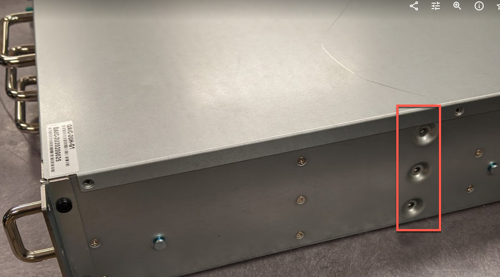
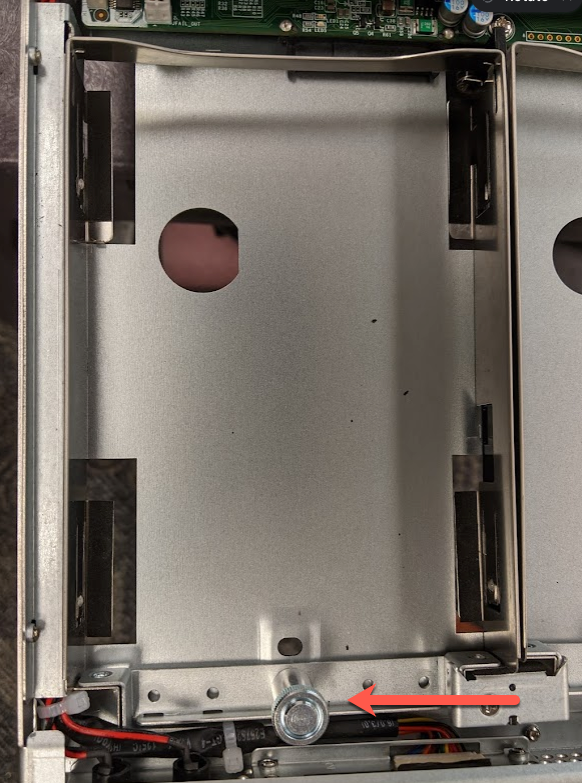

# C-Series 2U (C-168T / C-432T)

## Requirements 
1. Qumulo C Series 168T or 432T Hardware
2. Replacement Chassis on Site

## Replacement Process
1. Shut down the current node via front power button or by running `sudo shutdown -h now` over an SSH connection. 
2. With help available, disconnect all rear cabling on the node and pull from the rack, setting the node down on a flat surface. 
3. Press the large buttons on both sides of the chassis frame to release the lid. The inner components and motherboard should now be exposed. 

4. Locate and remove the internal M.2 Boot Drive, inserting it into the replacement chassis Qumulo has provided. 

5. Remove the rear NVME SSD drives and transfer them into the replacement chassis. 
 
6. Rack the replacement chassis in the appropriate rack location.
**NOTE:** Be sure to verify that any shipping screws have been removed from the replacement chassis as they will prevent the HDDs trays from sliding open. 

7. Starting with the top drawer, transfer the HDDs from each tray on the original chassis into their corresponding slots on the replacement chassis. For this portion it may be helpful to reference our C-Series Drive Diagrams page to ensure each drive is being transferred to the appropriate location. In order to remove the HDD drives, gently lift up on the drive tray knob allowing the drive to come forward and unlatch. Once the drive is transferred into the new chassis, gently slide the drive tray knob backwards latching both the knob and drive in place. 

**NOTE:** Only one drawer should be worked on at a time. To open the HDD drawers use the blue levers on the front of the node. The shelves may deform if a downward force of 2kg or more is applied while opened. 
8. With all the drives transferred you may now reconnect the rear power and networking cables. 
9. Power on your new node!

## (Optional) Reconfigure IPMI
If the current IPMI settings are set statically and not via DHCP, they will need to be reapplied to each node in the cluster. Reference the [IPMI Quick Reference Guide for Qumulo C-Series](https://care.qumulo.com/hc/en-us/articles/360024426314-IPMI-Quick-Reference-Guide-for-Qumulo-C-Series) article for additional details. 

## Resolution 
You should now be able to successfully replace the chassis for Qumulo’s C Series 192T or 432T platform. Please contact Qumulo Care to complete any RMA returns or if you have outstanding questions. 

