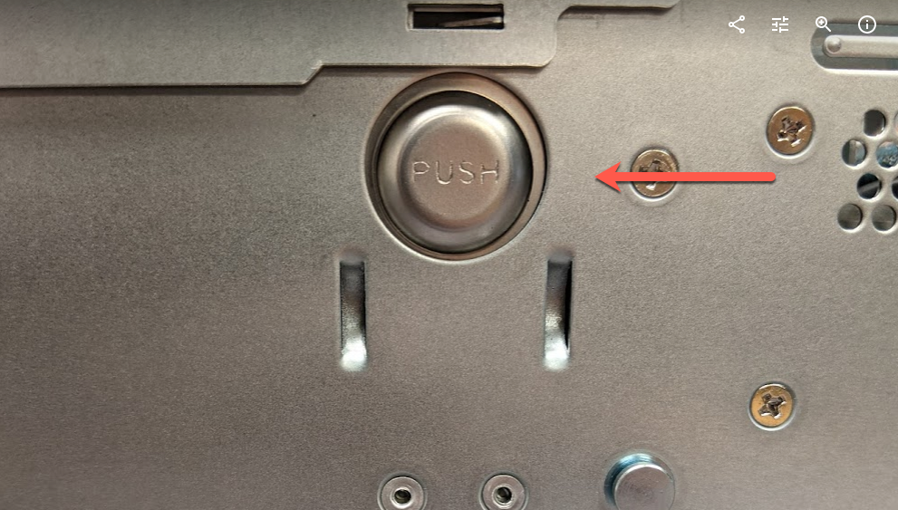

# C-Series 2U (C-168T / C-432T)

## Requirements 
1. Qumulo C Series 168T or 432T Hardware
2. Replacement Chassis on Site

## Replacement Process
1. Shut down the current node via front power button or by running `sudo shutdown -h now` over an SSH connection. 
2. With help available, disconnect all rear cabling on the node and pull from the rack, setting the node down on a flat surface. 
3. Press the large buttons on both sides of the chassis frame to release the lid. The inner components and motherboard should now be exposed. 

### Heading 3
Blah

### Node LEDs
On the front, right side of your node, there are five LEDs.

| Heading        | Heading                 | Heading                                 |
| ------------- | ---------------------- | ------------------------------------------- |
| Blah          | Blah         | Blah                             |          

**Note:** During normal operation, the **Lan B** LED might appear to be lit slightly when the **Disk Activity** LED is on.
