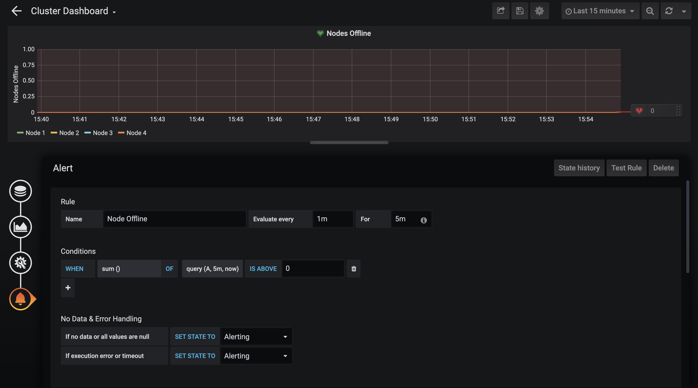



This section describes how you can configure Prometheus (an open-source, time-series database and collection system) to connect to the Qumulo API and poll its data at regular intervals. It also describes how you can use Grafana (an open-source analytics tool) to create dashboards with graphs and data that you can use to monitor the health of your Qumulo cluster, generate alerts, and improve your capacity statistics.

## Installing Prometheus
For information about installing Prometheus, see [Installation](https://prometheus.io/docs/prometheus/latest/installation/) in the Prometheus documentation. You can install Prometheus into a Docker container or use a configuration management system such as Ansible.

## Configuring Prometheus
**Important**: To use the OpenMetrics API, you you must configure your cluster to emit metrics without authentication. If your cluster isn't configure, open a request at [Qumulo Care](https://care.qumulo.com/hc/en-us/requests/new).

You can configure Prometheus by editing the `prometheus.yml` file. If this file doesn't exist already, create it and add your monitoring configuration to the file. You can use the following example as a template.

```yaml
---
global:
  scrape_interval: 1m

# The scrape configuration with one endpoint to scrape
scrape_configs:

  # The job name is added as the label `job=<job_name>`
  # to any time series scraped from this configuration.
  - job_name: 'qumulo'

    static_configs:
      # The hostname of your cluster.
      # We recommend using a DNS record associated with
      # one or more floating IP addresses from the cluster.
      - targets: ['<Hostname>:8000']

    metrics_path: '/v2/metrics/endpoints/default/data'

    scheme: https

    # The following setting lets us bypass our
    # untrusted, self-signed certificates.
    tls_config:
      insecure_skip_verify: true
```

## Installing and Configuring Grafana
Follow the Prometheus documentation for integrating with Grafana found [here](https://prometheus.io/docs/visualization/grafana/) in order to get Grafana up and running with Prometheus. Follow the Grafana documentation for integrating alerts with notification systems found [here](https://grafana.com/docs/grafana/latest/alerting/old-alerting/notifications/) in order to receive notifications when alerts are triggered.

Provided below are a few examples of some basic graphing and alerting setups that might be useful to have once you have Prometheus and Grafana up and running.

### Example: Create a Throughput Graph


This example with demonstrate how to setup a graph on Grafana to view total read and write throughput across your cluster. These instructions assume that you already have Grafana installed and configured to pull from a Prometheus instance, and will be based on the "Creating a Prometheus graph" section in the [Prometheus documentation](https://prometheus.io/docs/visualization/grafana/).

1. From the Grafana homepage, click on the "+" button on the left side of the screen and select **Create Dashboard**, or, if you already have a dashboard, click **Add Panel**, which will be the leftmost of the buttons at the top right corner of the screen.

1. Click **Add Query**.

1. In the dropdown next to "Query", select the data source you set up for your cluster.

1. In the box that says "Enter a PromQL query", enter the following:
  
   `sum by (protocol, io_type) (rate(qumulo_protocol_bytes[1m]))`

   This query will get the throughput rate over a 1 minute period, and sum over the protocol and io_type tags. For more information on writing PromQL queries, see the [Prometheus documentation](https://prometheus.io/docs/prometheus/latest/querying/basics/).

1. In the **Legend** box, enter `{{protocol}}: {{io_type}}`. This will label each time series shown on the graph by the protocol and the io_type.

1. On the side menu to the left, select the second icon down, **Visualization**. In the **Label** box under **Left Y** in the **Axes** section, enter something like "Throughput". This will add a label to the Y-axis on the left side of the graph.

1. In the same **Left Y** section, click on the **Unit** dropdown and select **Data (Metric)**, then "gigabytes". This will set the scale to show throughput in gigabytes instead of bytes.

1. On the side menu to the left again, select the next option down, **General**. In the **Title** box, enter something like "Cluster Throughput". This will set the title of the graph itself.

1. Hit the save icon in the top right corner and click **Save**.

1. Click the back arrow at the top left corner to go back to the dashboard page, where you should be able to see the new graph you just made with data starting to come in.

   * You can see a smaller time scale of your data by going to the top right corner and clicking on the dropdown that says "Last 6 hours" and setting it to something smaller such as 15 minutes.

For more information about dashboards, panels, or other visualizations, see their respective sections in the [Grafana documentation](https://grafana.com/docs/grafana/latest/).

### Example: Alert on Offline Node

Administrators want to be promptly notified when there is an issue in their cluster preventing one or more nodes from being online. Being in this state risks additional failures taking the entire cluster offline, as well as reduced performance and eventually the inability to write to the cluster. We'll get notified quickly of this state by making a alarm in Grafana.

To make an alarm we'll follow [this guide](https://grafana.com/docs/grafana/latest/alerting/old-alerting/create-alerts/).

1. Start by setting up a graph of `qumulo_quorum_node_is_offline`. You can use the previous example as a guide and replace the query with the following:
    `qumulo_quorum_node_is_offline`

1. In the **Legend** box, enter `Node {{node_id}}`.

1. In the **Visualization** tab, in the **Left Y** section, set **Y-min** to "0".

1. Before saving the graph, go to the **Alert** tab in the side menu and click **Create Alert**.

1. Name the alarm "Node Offline".

1. Evaluate every 1 minute to match the scrape interval.

1. If you would like to not be notified of transient issues, such as a networking blip that temporarily makes a node offline, set **For** to 5 minutes. When an alarm is initially triggered, it will be set to a "Pending" state. Once it has been triggered for 5 minutes, the alarm will go to an "Alerting" state and alarm notifications will be sent out.

1. Set the conditions for the alert to be `sum()` is above 0. This will cause the alarm to trigger if any node goes offline for a period of 1 minute.

1. In the event that your cluster goes down entirely, the metrics API will not be able to output any metrics, meaning that the alarm will not go off. To avoid this, make sure that the "If execution error or timeout" setting is set to "Alerting". This will ensure that the alarm goes off if the cluster goes down.

1. Select a notification channel to receive the alerts and add a message that should come with the alert.

1. Click **Test Alert** to test the alert to make sure it is working.

1. Click the save icon in the top right corner to save the alert.

Here is what the alarm configuration should look like:


For more information on alerts, see the [Grafana documentation](https://grafana.com/docs/grafana/latest/alerting/old-alerting/).

### Example: Alert on Cluster Full

Knowing how much free space is left in a cluster is very important, and in many cases it is useful to have an alarm that will alert when the cluster is almost full. In this example we will create a graph to show how full the cluster is and set an alarm to alert if it gets too full.

1. Start by setting up a graph of used space. You can use the previous example as a guide and replace the query with the following:

    `1 - qumulo_free_bytes / qumulo_capacity_bytes`

    This will show the amount of space being used in the cluster as a percentage of the total capacity, so an empty cluster would be 0% used space, and a full cluster would be 100%.

1. In the **Visualization** tab, go to the **Unit** dropdown in the **Left Y** section and choose "percent (0.0-1.0)".

1. In the same **Left Y** section, set **Y-min** to "0" and **Y-max** to "1".

1. Before saving the graph, go to the **Alert** tab in the side menu and click **Create Alert**.

1. Name the alarm "Cluster Full".

1. Evaluate every 1 minute to match the scrape interval.

1. If you would like to not be notified of transient issues, such as space usage spiking for a second, set **For** to 5 minutes. When an alarm is initially triggered, it will be set to a "Pending" state. Once it has been triggered for 5 minutes, the alarm will go to an "Alerting" state and alarm notifications will be sent out.

1. Set the conditions for the alert to be `avg()` is below 10. This means that the alarm will go off if the cluster averages below 10% free space over the period of time specified in the **For** field.

1. Enter the notification channel you want alerts to be sent to as well as a message.

1. Click the save icon in the top right corner.

Here is what the final alarm configuration should look like:


For more information on alerts, see the [Grafana documentation](https://grafana.com/docs/grafana/latest/alerting/old-alerting/).
