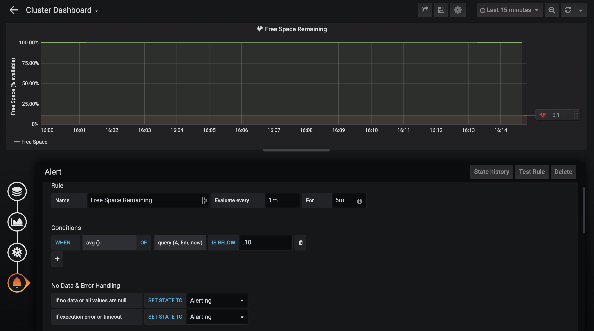



This section describes how you can configure Prometheus (an open-source, time-series database and collection system) to connect to the Qumulo API and poll its data at regular intervals. It also describes how you can use Grafana (an open-source analytics tool) to create dashboards with graphs and data that you can use to monitor the health of your Qumulo cluster, generate alerts, and improve your capacity statistics.

## Installing and Configuring Prometheus
For information about installing Prometheus, see [Installation](https://prometheus.io/docs/prometheus/latest/installation/) in the Prometheus documentation. You can install Prometheus into a Docker container or use a configuration management system such as Ansible.

**Important**: To use the OpenMetrics API, you you must configure your cluster to emit metrics without authentication. If your cluster isn't configured for this, open a request at [Qumulo Care](https://care.qumulo.com/hc/en-us/requests/new).

You can configure Prometheus by editing the `prometheus.yml` file. If this file doesn't exist already, create it and add your monitoring configuration to the file. You can use the following example as a template.

```yaml
---
global:
  scrape_interval: 1m

# The scrape configuration with one endpoint to scrape
scrape_configs:

  # Prometheus adds the job name as the label `job=<job_name>`
  # to any time series scraped from this configuration.
  - job_name: 'qumulo'

    static_configs:
      # The hostname of your cluster. We recommend using
      # a DNS record associated with one or more floating
      # IP addresses from the cluster.
      - targets: ['<Hostname>:8000']

    metrics_path: '/v2/metrics/endpoints/default/data'

    scheme: https

    # The following setting lets us bypass our
    # untrusted, self-signed certificates.
    tls_config:
      insecure_skip_verify: true
```

## Installing and Configuring Grafana
For information about integrating Prometheus with Grafana, see [Grafana Support for Prometheus](https://prometheus.io/docs/visualization/grafana/) in the Prometheus documentation. For information about integrating alerts with notification systems to receive notifications when alerts are triggered, see [Alert Notifications](https://grafana.com/docs/grafana/latest/alerting/old-alerting/notifications/) in the Grafana documentation.

The following examples show basic graphing and alerting configurations.

### To Create a Throughput Graph
This example explains how you can configure a Grafana graph to show total read and write throughput across your cluster. For more information, see [Creating a Prometheus Graph](https://prometheus.io/docs/visualization/grafana/#creating-a-prometheus-graph) in the Prometheus documentation.

**Note:** Before you begin, ensure that you have Grafana installed and configured to pull from a Prometheus instance. 

1. In Grafana, click **+** and then click **Create Dashboard**.

   If you already have a dashboard, at the top right click **Add Panel**.

1. Click **Add Query** and select the data source for your cluster from the list next to **Query**.

1. For **Enter a PromQL query**, enter `sum by (protocol, io_type) (rate(qumulo_protocol_bytes[1m]))`.

   This query retrieves the throughput rate over a one-minute period, and the sum across the `protocol` and `io_type` tags. For information about writing PromQL queries, see the [Querying Prometheus](https://prometheus.io/docs/prometheus/latest/querying/basics/) in the Prometheus documentation.

1. To label each time series on the graph by `protocol` and `io_type`, for **Legend** enter `{{protocol}}: {{io_type}}`.

1. On the left menu, click **Visualization** and in the **Axes** section, under **Left Y**, do the following:

   a. Enter a **Label** for the Y-axis of the graph, for example `Throughput`.

   b. To set the scale to show throughput in gigabytes, click **Unit** and select **Data (Metric) > gigabytes**.

1. On the left menu, click **General** and enter a **Title** for the graph, for example `Cluster Throughput`.

1. At the top right, click  and then click **Save**.

1. At the top left, click .

   On the dashboard page, your graph appears.

   

1. (Optional) To see a smaller time scale of your data, at the top right click **Last 6 hours** and set it to a smaller vallue, for example 15 minutes.

For more information about dashboards, panels, and other visualizations, see the [Grafana documentation](https://grafana.com/docs/grafana/latest/).

### To Create an Alert for an Offline Node
This example explains how an administrator can receive a notification when a node in a cluster is offline. An offline node creates risks of additional failures that can cause reduced performance, inability to write to the cluster, or take the entire cluster offline. For more information, see [Create Alerts](https://grafana.com/docs/grafana/latest/alerting/old-alerting/create-alerts/) and [Legacy Grafana Alerts](https://grafana.com/docs/grafana/latest/alerting/old-alerting/) in the Grafana documentation.

1. Configure a graph for `qumulo_quorum_node_is_offline`.

   a. Use the example in the [To Create a Throughput Graph](#to-create-a-throughput-graph) section and replace the query with `qumulo_quorum_node_is_offline`.

   b. For **Legend**, enter `Node {{node_id}}`.

   c. On the **Visualization** tab, in the **Left Y** section, enter `0` for **Y-min**.

   d. On the **Alert** tab, on the left menu, click **Create Alert**.

1. Enter a name for the alarm, for example `Node Offline`.

1. To match the scrape interval, set the alarm to evaluate every minute.

1. If you would like to not be notified of transient issues, such as a networking blip that temporarily makes a node offline, set **For** to 5 minutes. When an alarm is initially triggered, it will be set to a "Pending" state. Once it has been triggered for 5 minutes, the alarm will go to an "Alerting" state and alarm notifications will be sent out.

1. Set the conditions for the alert to be `sum()` is above 0. This will cause the alarm to trigger if any node goes offline for a period of 1 minute.

1. In the event that your cluster goes down entirely, the metrics API will not be able to output any metrics, meaning that the alarm will not go off. To avoid this, make sure that the "If execution error or timeout" setting is set to "Alerting". This will ensure that the alarm goes off if the cluster goes down.

1. Select a notification channel to receive the alerts and add a message that should come with the alert.

1. Click **Test Alert** to test the alert to make sure it is working.

1. Click .

### To Alert on a Full Cluster

Knowing how much free space is left in a cluster is very important, and in many cases it is useful to have an alarm that will alert when the cluster is almost full. In this example we will create a graph to show how full the cluster is and set an alarm to alert if it gets too full.

For information about alerts, see the [Grafana documentation](https://grafana.com/docs/grafana/latest/alerting/old-alerting/).

1. Start by setting up a graph of used space. You can use the previous example as a guide and replace the query with the following:

    `1 - qumulo_free_bytes / qumulo_capacity_bytes`

    This will show the amount of space being used in the cluster as a percentage of the total capacity, so an empty cluster would be 0% used space, and a full cluster would be 100%.

1. In the **Visualization** tab, go to the **Unit** dropdown in the **Left Y** section and choose "percent (0.0-1.0)".

1. In the same **Left Y** section, set **Y-min** to "0" and **Y-max** to "1".

1. Before saving the graph, go to the **Alert** tab in the side menu and click **Create Alert**.

1. Name the alarm "Cluster Full".

1. Evaluate every 1 minute to match the scrape interval.

1. If you would like to not be notified of transient issues, such as space usage spiking for a second, set **For** to 5 minutes. When an alarm is initially triggered, it will be set to a "Pending" state. Once it has been triggered for 5 minutes, the alarm will go to an "Alerting" state and alarm notifications will be sent out.

1. Set the conditions for the alert to be `avg()` is below 10. This means that the alarm will go off if the cluster averages below 10% free space over the period of time specified in the **For** field.

1. Enter the notification channel you want alerts to be sent to as well as a message.

1. Click the save icon at the top right corner.

Here is what the final alarm configuration should look like:

