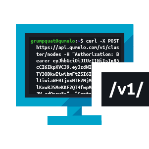

To get started, choose one of the following guides.

<h2 class="frontpage">Cloud: Self-Managed File System</h2>

  

    <a class="big-button" href="cloud-native-aws-administrator-guide/">
      <figure>
        <picture>
          <source type="image/webp" srcset="images/cloud-native-qumulo-on-aws-administrator-guide.webp">
          <source type="image/png" srcset="images/cloud-native-qumulo-on-aws-administrator-guide.png">
          
        </picture>
        <figcaption>{{site.guides.cnqShort}}</figcaption>
      </figure>
    </a>
  

  

    <a class="big-button" href="cloud-native-azure-administrator-guide/">
      <figure>
        <picture>
          <source type="image/webp" srcset="images/cloud-native-qumulo-on-azure-administrator-guide.webp">
          <source type="image/png" srcset="images/cloud-native-qumulo-on-azure-administrator-guide.png">
          
        </picture>
        <figcaption>{{site.guides.cnqAzureShort}}</figcaption>
      </figure>
    </a>
  

  

    <a class="big-button" href="cloud-native-gcp-administrator-guide/">
      <figure>
        <picture>
          <source type="image/webp" srcset="images/cloud-native-qumulo-on-gcp-administrator-guide.webp">
          <source type="image/png" srcset="images/cloud-native-qumulo-on-gcp-administrator-guide.png">
          
        </picture>
        <figcaption>{{site.guides.cnqGCPShort}}</figcaption>
      </figure>
    </a>
  

<h2 class="frontpage">Cloud: Qumulo-Managed File System</h2>

  <a class="big-button" href="azure-native-administrator-guide/">
    <figure>
      <picture>
        <source type="image/webp" srcset="images/azure-native-qumulo-administrator-guide.webp">
        <source type="image/png" srcset="images/azure-native-qumulo-administrator-guide.png">
        
      </picture>
      <figcaption>{{site.guides.anqShort}}</figcaption>
    </figure>
  </a>

<h2 class="frontpage">On-Premises: Self-Managed File System</h2>

  

    <a class="big-button" href="administrator-guide/">
      <figure>
        <picture>
          <source type="image/webp" srcset="images/on-premises-administrator-guide.webp">
          <source type="image/png" srcset="images/on-premises-administrator-guide.png">
          
        </picture>
        <figcaption>{{site.guides.onpremShort}}</figcaption>
      </figure>
    </a>
  

  

    <a class="big-button" href="hardware-guide/">
      <figure>  
        <picture>
          <source type="image/webp" srcset="images/qumulo-certified-platinum-tier-hardware-servicing-guide.webp" width="301" height="301">
          <source type="image/png" srcset="images/qumulo-certified-platinum-tier-hardware-servicing-guide.png" width="301" height="301">
          
        </picture>
        <figcaption class="platinum-tier-caption">{{site.guides.hard}}</figcaption>
      </figure>
    </a>
  

  

    <a class="big-button" href="gold-tier-hardware-servicing-guide/">
      <figure>
        <picture>
          <source type="image/webp" srcset="images/gold-tier-hardware-servicing-guide.webp" width="301" height="301">
          <source type="image/png" srcset="images/gold-tier-hardware-servicing-guide.png" width="301" height="301">
          
        </picture>
        <figcaption class="gold-tier-caption">{{site.guides.hardGold}}</figcaption>
      </figure>
    </a>
  

<h2 class="frontpage">Developer Tools and Interfaces</h2>

  

    <a class="big-button" href="qq-cli-command-guide/">
      <figure>
        <picture>
          <source type="image/webp" srcset="images/qumulo-qq-cli-command-guide.webp">
          <source type="image/png" srcset="images/qumulo-qq-cli-command-guide.png">
          
        </picture>
        <figcaption>{{site.guides.cli}}</figcaption>
      </figure>
    </a>
  

  

    <a class="big-button" href="rest-api-guide/">
      <figure>
        <picture>
          <source type="image/webp" srcset="images/qumulo-rest-api-guide.webp">
          <source type="image/png" srcset="images/qumulo-rest-api-guide.png">
          
        </picture>
        <figcaption>{{site.guides.rest}}</figcaption>
      </figure>
    </a>
  

<h2 class="frontpage">External Alerting and Monitoring</h2>

  

    <a class="big-button" href="qumulo-nexus-configuration-guide/">
      <figure>
        <picture>
          <source type="image/webp" srcset="images/qumulo-nexus-configuration-guide.webp">
          <source type="image/png" srcset="images/qumulo-nexus-configuration-guide.png">
          
        </picture>
        <figcaption>{{site.guides.nexus}}</figcaption>
      </figure>
    </a>
  

  

    <a class="big-button" href="qumulo-alerts-guide/">
      <figure>
        <picture>
          <source type="image/webp" srcset="images/qumulo-alerts-guide.webp">
          <source type="image/png" srcset="images/qumulo-alerts-guide.png">
          
        </picture>
        <figcaption>{{site.guides.alertShort}}</figcaption>
      </figure>
    </a>
  

  

    <a class="big-button" href="integration-guide/">
      <figure>
        <picture>
          <source type="image/webp" srcset="images/qumulo-integration-guide.webp">
          <source type="image/png" srcset="images/qumulo-integration-guide.png">
          
        </picture>
        <figcaption>{{site.guides.integ}}</figcaption>
      </figure>
    </a>
  

## Hot Topics
The following are the most-accessed pages on the Documentation Portal.

1. [Qumulo Core Feature Log](/administrator-guide/upgrading-qumulo-core/feature-log.html)
2. [Performing Qumulo Core Upgrades](/administrator-guide/upgrading-qumulo-core/performing-upgrades.html)
3. [Configuring Round-Robin DNS on Windows Server for Qumulo Core](/administrator-guide/network-configuration/configuring-round-robin-dns-windows-server.html)
4. [Qumulo Core Upgrade Mode Reference](/administrator-guide/upgrading-qumulo-core/mode-reference.html)
5. [Enabling Cloud-Based Monitoring and Remote Support](/administrator-guide/monitoring-and-metrics/enabling-cloud-based-monitoring-remote-support.html)
6. [Getting Started with the qq CLI](/administrator-guide/qq-cli/getting-started.html)
7. [Creating a Qumulo Core USB Drive Installer](/hardware-guide/getting-started/creating-usb-drive-installer.html)
8. [Supported Configurations and Known Limits for Qumulo Core](/administrator-guide/getting-started/supported-configurations-known-limits.html)
9. [Replication Version Requirements and Upgrade Recommendations for Qumulo Core](/administrator-guide/upgrading-qumulo-core/replication-version-requirements-upgrade-recommendations.html)
10. [Installing the Qumulo Core Product Package](/administrator-guide/getting-started/installing-product-package.html)

## Get Qumulo Core
{{site.nexus.downloads}} {{site.loginRequired}}.

For information about upgrading, see:
* [Feature Log](/administrator-guide/upgrading-qumulo-core/feature-log.html)
* [Qumulo Core Upgrade Mode Reference](/administrator-guide/upgrading-qumulo-core/mode-reference.html)
* [Performing Instant Software Upgrades and Platform Upgrades](/administrator-guide/upgrading-qumulo-core/instant-software-platform.html)

## Reach Out to Us
If you need help, [open a case](https://care.qumulo.com/s/submit-a-case), or {{site.contactQumuloCare}} through Slack, email, or by phone.
