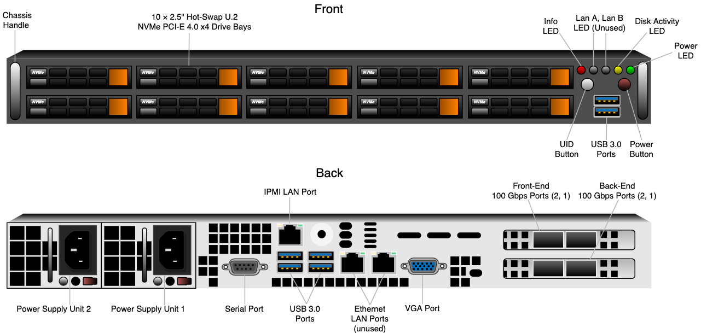
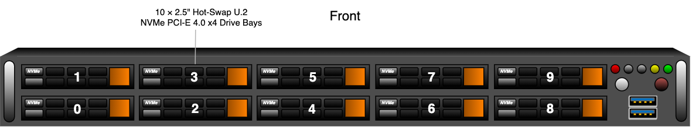
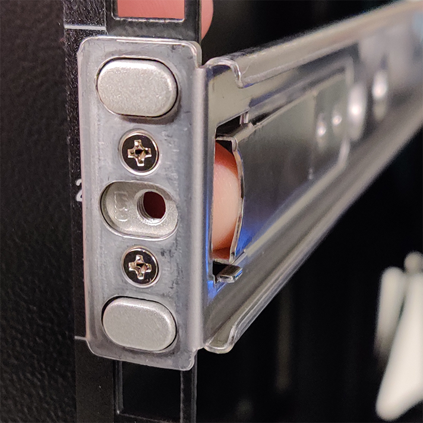
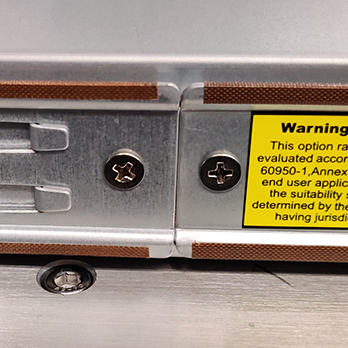
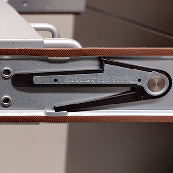
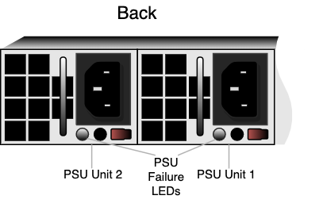

# Qumulo on Supermicro All-NVMe Getting Started Guide
Welcome to Qumulo on Supermicro All-NVMe. This guide is intended for system administrators, professional service providers, and colleagues in your organization who are responsible for installing and configuring server hardware.

This guide includes quick-reference diagrams for Supermicro A+ WIO 1114S-WN10RT All-NVMe nodes and cluster architecture diagrams, an explanation of node LEDs, and a diagram of drive slots and PCIe mapping. Next, the guide explains the networking configuration for your node and then walks you through racking and wiring your nodes, installing Qumulo Core on your nodes, and creating a Qumulo cluster. Finally, the guide explains how to replace hardware components and the [Appendix](#appendix) contains the currently known behavior of Supermicro All-NVMe nodes and technical specifications.

For more information about administering your cluster, see the [Qumulo Care](https://care.qumulo.com/hc/en-us) portal. If you have any questions, you can [open a case](https://care.qumulo.com/hc/en-us/requests/new), email us at [care@qumulo.com](mailto:care@qumulo.com), or contact us in your private channel in the [qumulocare](https://qumulocare.slack.com/) Slack workspace.


## Quick Reference
This section contains quick-reference diagrams for the front and back of your Supermicro All-NVMe node, an architecture diagram of an example four-node cluster, an explanation of node LEDs, and a diagram of drive slots and PCIe mapping.

### Front and Back Node Diagrams


### Four-Node Cluster Architecture Diagram


### Node LEDs
On the front, right side of your node, there are five LEDs.

| Label         | Colors                 | Description                                 |
| ------------- | ---------------------- | ------------------------------------------- |
| Info          | 🔴 (solid red)         | Node overheated                             |          
| Info          | 🔴 (1 s. blinking red) | Fan failed                                  |
| Info          | 🔴 (4 s. blinking red) | Power Supply Unit (PSU) failed              |
| Info          | 🔵 (solid blue)        | Unit IDentification (UID) activated locally |
| Info          | 🔵 (blinking blue)     | UID activated using IPMI                    |
| Lan A         | ⚪ (off)               | Unused                                      |
| Lan B         | ⚪ (off)               | Unused                                      |
| Disk Activity | 🟡 (solid yellow)      | On or blinking                              |
| Power         | 🟢 (solid green)       | On                                          |

**Note:** During normal operation, the **Lan B** LED might appear to be lit slightly when the **Disk Activity** LED is on.

On the back of your node, LAN LEDs are located behind the vent holes on the NIC. Each port has one light. Network traffic *doesn't* affect the speed of the light's blinking.

| Color            | Status             | Description      |
| ---------------- | ------------------ | ---------------- |
| &#8212;          | Off                | No link          |
| 🟢 (solid green) | On or blinking     | Link established |

### Drive Slot Mapping
Your node contains slots for 10 drives and one boot drive (in an internal M.2 slot). The following is the mapping for the drives.




## Configuring Networking for Your Node
This section explains the networking prerequisites, outlines the recommended networking configuration, and explains how you can connect to redundant switches or to a single switch.

### Networking Prerequisites
**Important:** Before you create your Qumulo cluster, you must configure all switch ports connected to the back-end NIC to have at least 9,000 MTU, with Jumbo Frames enabled.

Your node requires the following resources.
* A network switch with the following specifications:
  * 100 Gbps Ethernet
  * Fully non-blocking architecture
  * IPv6 capability
  * Jumbo Frame support (9,000 MTU minimum) for the back-end network
* Compatible networking cables
* A sufficient number of ports for connecting all nodes to the same switch fabric
* One static IP per node, per defined VLAN

### Recommended Networking Configuration
**Important:** We don't recommend connecting to a single back-end NIC port because the node will become unavailable if the single connection fails.

The Supermicro All-NVMe platform uses a networking configuration in which different NICs handle back-end and front-end traffic. You can connect the front-end and back-end NICs to the same switch or to different switches. However, for greater reliability, we recommend connecting all four 100 Gbps ports on every node: connect both front-end NIC ports to the front-end switch and both back-end NIC ports to the back-end switch.

We recommend the following configuration for your node.
* One set of redundant switches for the front-end network, with an MTU that matches that of the clients that use the storage cluster. Typically, 1,500 MTU is recommended, but in some instances it might be 9,000 MTU.
* One set of redundant switches for the back-end network (9,000 MTU minimum)
* One physical connection per node, per each redundant switch
* One Link Aggregation Control Protocol (LACP) port-channel per network (front-end and back-end) on each node, with the following configuration
  * Active mode
  * Slow transmit rather
  * Access port or trunk port with a native VLAN
* DNS servers
* A Network Time Protocol (NTP) server
* Firewall protocols or ports allowed for proactive monitoring
* Where `N` is the number of nodes, `N-1` floating IPs per node, per client-facing VLAN

### Connecting a Cluster to Redundant Switches
For redundancy, we recommend connecting a Supermicro All-NVMe cluster to dual switches. If either switch becomes inoperative, the cluster will still be accessible from the remaining switch.

* **Front End**
  * Connect the two front-end NIC ports (2 &#215; 100 Gbps) on your nodes to separate switches.
  * The uplinks to the client network must equal the bandwidth from the cluster to the switch.
  * The two ports form an LACP port channel using a multi-chassis link aggregation group.
* **Back End**
  * Connect the two back-end NIC ports (2 &#215; 100 Gbps) on your nodes to separate switches.
  * Use an appropriate inter-switch link or virtual port channel.
* **MTU**
  * For all connection speeds, the default behavior is that of an LACP with 1,500 MTU for the front-end and 9,000 MTU for the back-end interfaces.

### Connecting a Cluster to a Single Switch
You can connect a Supermicro All-NVMe cluster to a single switch. If this switch becomes inoperative, the entire cluster will be inaccessible.

* **Front End**
  * Each node has two front-end NIC ports (2 &#215; 100 Gbps) connected to a single switch.
  * The uplinks to the client network must equal the bandwidth from the cluster to the switch.
  * The two ports form an LACP port channel. 
* **Back End**
  * Each node has two band-end ports (2 &#215; 100 Gbps) connected to a single switch.
* **MTU**
  * For all connection speeds, the default behavior is that of an LACP with 1,500 MTU for the front-end and 9,000 MTU for the back-end interfaces.


## Step 1: Racking Your Nodes
**Tip:** You can use the following instructions to add new nodes after your initial cluster deployment.

This section describes how to use the outside and inside rails of your Supermicro All-NVMe node and how to rack your nodes in your data center.

### To Attach the Outer and Inner Rails
**Note:** Because the left and right rails of your nodes are identical, the words **FRONT** and **BACK** might appear upside down.

* Each *outer rail* comes as two connected pieces and attaches to your server rack.
* Each *inner rail* comes as two separate pieces and attaches to the node chassis.

1. Adjust the outer rails to the length of your server rack.
1. Line up the edge of the outer rail between the rack unit (RU) markers, insert the tabs on the edge of the rail into the mounting holes, and push the rail into the rack until the quick-release clicks into place. This process is the same for the front and back of your rack.

   

1. Snap the inner rails to the chassis and secure them using two screws on each side, near the middle of the chassis.

   **Note:** First attach the front inner rails, then the back inner rails.

   

### To Insert the Chassis
1. Align the outer and inner rails and insert the chassis into the server rack.
1. Attach the chassis to the rack using one screw on each side, on the front of the chassis.

### To Remove the Chassis
1. Disconnect any cables from the chassis. 
1. Remove one screw from each side of the front of the chassis.
1. Pull the chassis out from the server rack partially. When the first set of black snaps appears, pinch the long piece of the snap towards the short one (up on one side, down on the other).

   

1. Continue to pull the chassis from the server rack. When the second set of black snaps appears, pinch the long piece of each snap towards the short one (up on one side, down on the other) and remove the chassis completely.


## Step 2: Wiring Your Nodes
This section describes how to wire the remote access, network, and power ports of your Supermicro All-NVMe node.

**Note:** The two Ethernet ports on the back of your node (to the right of the USB ports) are unused.

### Connecting the Out-of-Band Management (IPMI) Port
The dedicated out-of-band management port allows functionality such as remote display, control, and power (similar to HPE iLO). The port uses the Intelligent Platform Management Interface (IPMI) protocol. First, connect the IPMI port first on the back of your node (above the USB ports).

### Connecting the 100 Gbps Ports
After you connect the IPMI port, connect your front-end and back-end 100 Gbps ports (compatible with QSFP28 and QSFP56). There are four 100 Gbps ports on the back of your node. To maximize redundancy, split interfaces across subnets by connecting each port to a different switch.

| Port Location         | Port Labels        | Port Type  | Purpose                     |
| --------------------- | ------------------ | ---------- | --------------------------- |
| Top row               | 2 (eth3), 1 (eth2) | Front end  | Communication with clients  |
| Bottom row            | 2 (eth5), 1 (eth4) | Back end   | Communication between nodes |

### Connecting the Power
**Important:** Make sure that the voltages for both power supply units (PSUs) are the same (for example, both at 115 V or both at 208 V).

After you connect your 100 Gbps ports, connect power to the node. There are two power sockets on the back of your node. To maximize redundancy, connect each PSU to a separate power supply or power distribution unit (PDU).

## Step 3: Installing Qumulo Core on Your Nodes
This section describes how to install Qumulo Core on your Supermicro All-NVMe nodes.

### Creating a Qumulo Core USB Drive Installer
To perform a clean installation of Qumulo Core on your node, you must create a Qumulo Core USB Drive Installer. To begin, you must have a USB drive (4 GB minimum) and a Qumulo Core USB installer image from the [Qumulo Care Team](https://care.qumulo.com/hc/en-us/articles/115008409408-Contact-Qumulo-Care-).

#### To Create a USB Drive Installer on Mac OS
1. Open Terminal and log in as `root` by using the `sudo -s` command.

1. Insert your USB drive and then find its disk label by using the `diskutil list` command. In the following example, the USB drive's device label is `disk2`.

   ```bash
   /dev/disk2 (external, physical):
      #:                       TYPE NAME                    SIZE       IDENTIFIER
      0:             Windows_FAT_32 MY_USB_DRIVE            *32.0 GB    disk2
   ```

1. To unmount the USB drive, use your USB drive's device label, for example:

   ```bash
   diskutil unmountDisk /dev/disk2
   ```

1. To write the Qumulo Core USB installer image to your USB drive, specify the path to your image file and the USB drive's device label, for example:

   ```bash
   dd if=/path-to-image-file/ of=/dev/rdisk2 bs=2m
   ```

   **Note:** If you encounter an **Operation not permitted** error, navigate to **System Preferences > Security & Privacy**, on the **Privacy** tab grant **Full Disk Access** to Terminal, restart Terminal, and then try the command again. When finished, remove **Full Disk Access** from Terminal.

1. Eject your Qumulo Core USB Drive Installer, for example:

   ```bash
   diskutil eject disk2
   ```

#### To Create a USB Drive Installer on Windows
To create a USB Drive Installer on Windows, you must use a third-party application such as [Rufus](https://rufus.ie/). We recommend Rufus because it can detect many USB storage devices (rather than only Windows-compatible ones).

**Important:**
* We don't recommend using other tools (such as Win32 Disk Imager) because they might encounter errors when unable to recognize the USB drive after writing data to it.
* When the operation concludes, you might not be able to view the contents of the USB drive on Windows because the drive will be formatted using a different file system.

1. Press the **Power** button.

1. Insert your USB drive and run Rufus.

1. Under **Drive Properties**, select a device and the path to the Qumulo Core USB installer image.

1. For **Partition scheme**, select **MBR** and for **Target System**, select **BIOS or UEFI**.
   
1. Under **Format Options**, ensure that the **File system** is **FAT32 (Default)** and **Cluster size** is **4096 bytes (Default)**.

1. Click **Start**.

1. If prompted to download a new version of `GRUB` or `vesamenu.c32`, click **No**.

1. When the **ISOHybrid image detected** dialog box appears, click **Write in DD Image mode** and then click **OK**.

1. To confirm the operation, destroy all data on the USB drive, and image the drive click **OK**.

### Running the Field Verification Tool (FVT) and Installing Qumulo Core
The Field Verification Tool (FVT) checks your node, prepares it for Qumulo Core, and installs Qumulo Core.

**Caution:** The FVT erases all data from the node. You must back up any live data on the node before you run the FVT.

1. When the node powers on and begins to boot, on the **Supermicro** screen, press **F11**. The following message appears:

   ```bash
   DXE--BIOS PCI Bus Enumeration
   Invoking Boot Menu
   ```

1. On the **Please select boot device:** screen, select your USB drive (usually labelled with `UEFI OS`) and boot into it.

   The FVT starts automatically and the following message appears.

   ```bash
   RELEASE: Qumulo Core X.X.X

   Please choose from the following options:
   [1] Factory reset (DESTROYS ALL DATA)
   [*] Perform maintenance
   >
   ```

1. Enter `1`.

   The following message appears.

   ```bash
   You are running a FACTORY RESET. This will wipe all data on BOTH the boot drive AND the data drives.
   This operation is going to DESTROY ALL DATA on the cluster, in order to proceed you must type "DESTROY ALL DATA" ("no" cancels):
   ```

1. To continue, enter `DESTROY ALL DATA`.

   The following message appears.

   ```bash
   Running FVT. Please wait...
   ```

1. When the FVT finishes, the following message appears.

   ```bash
   FVT passed!

   Wiping boot drive.
   Writing OS image.
   Writing container image.
   Wiping data drives.
   Installation successful. Ctrl-C to cancel reboot.
   ```

   Qumulo Core is now installed on your node.

#### Troubleshooting FVT Fail Cases
If the FVT encounters an issue, the `FVT failed!` message and an explanation appears.

FVT fail cases divide into *fixable* and *non-fixable* issues.

##### Fixable Issues
The following is an example of a fixable issue. To let FVT try fix the issue, enter `1`.

```bash
FVT failed!

The following issues were detected:
check_bmc_version: FAIL: We require a minimum BMC version of 1.00.34. You have 1.00.33.
FIX: Run the FVT flash command.

[1] Run FVT Flash. This will try to fix issues then reboot. Please take caution as this MAY DESTROY EXISTING DATA.
[2] Start a rescue shell
```

Depending on your node hardware and installation scenario, FVT might be able to correct issues such as the following automatically:

  * BIOS configuration
  * Drive firmware
  * NIC mode
  * Boot order

##### Non-Fixable Issues
The following is an example of a non-fixable issue. To fix the issue, contact the [Qumulo Care Team](https://care.qumulo.com/hc/en-us/articles/115008409408-Contact-Qumulo-Care-).

```bash
FVT failed!

The following issues were detected:
check_cpu_model: FAIL: We require one of: AMD EPYC 7402P 24-Core Processor. You have Qumulo Grumpquat 4000 Processor.
FIX: Contact Qumulo Care.
Not fixable issues were detected.

[1] Copy logs to USB installer.
[2] Start a rescue shell
```

#### Performing the Part Replacement Procedure Using the FVT
When you replace a component of your node (such as the motherboard or an NIC card), you must ensure that the firmware version and configuration are correct for your new components. To do this, you must perform the part replacement procedure using the FVT.

**Note:** Before you replace the motherboard, you must request a new DCMS license key from Supermicro and apply it before you run the FVT. (The license key uses the BMC MAC address which changes with the motherboard.) For more information, see [Data Center Management Suite (DCMS) Licenses](#data-center-management-suite-dcms-licenses).

1. [Boot using the latest version of the Qumulo Core USB Drive Installer](#running-the-field-verification-tool-fvt-and-installing-qumulo-core).

1. When prompted, enter `*` to select `[*] Perform maintenance`.

   The following message appears.

   ```bash
   Please choose from the following options:
   [1] Boot drive reset (DESTROYS BOOT DRIVE CONTENTS)
   [2] Perform automatic repair after part replacement (non-destructive)
   [3] Drop to a shell to perform manual maintenance
   >
   ```

1. Enter `2`.

   The part replacement procedure runs and the following message appears.

   ```bash
   Running FVT. Please wait...
   100%|▮▮▮▮▮▮▮▮▮▮▮▮▮▮▮▮▮▮▮▮▮▮▮▮▮▮▮▮▮▮▮▮▮▮▮▮▮▮▮▮▮▮▮▮▮▮▮▮▮▮▮▮▮▮▮▮▮▮▮▮▮▮▮▮▮▮▮▮▮▮▮▮▮▮▮▮▮▮▮▮▮▮▮▮▮▮▮▮▮▮▮▮▮▮▮▮▮▮▮▮| 13/13 [00:26<00:00, 2.01s/check]
   FVT passed!

   No issues were detected, the system is ready to utilize the replaced parts.
   
   Actions:
   [1] Shut down the system. After the system powers off, you may remove the USB stick and then power on the system to boot into the product.
   [2] Start a rescue shell
   >
   ```

**Note:** In some cases, after the part replacement procedure, the message `FIX: Run the FVT flash command.` appears. Enter `1` as you would for a [fixable issue](#fixable-issues) to reboot the node and then repeat the part replacement procedure.


## Step 4: Creating a Qumulo Cluster
This section describes how to configure your Supermicro All-NVMe nodes to form a Qumulo cluster.

### To Create the Cluster
1. Power on four or more nodes that run the same version of Qumulo Core.
1. Review the End User Agreement and when ready click **I agree to the End User Agreement**.
1. In the **1. Set up cluster** section, do the following:

   a. Enter a **Cluster name**.
   
   b. Click the checkmark next to each node to add to your cluster. The total cluster capacity appears at the bottom of the page.
   
   c. Check that your nodes are ordered according to their physical arrangement in the server rack. You can check your nodes' order in the following ways:

   * Power on the nodes one at a time and watch the nodes populate this page.
   * Retrieve the MAC address for each node and compare the addresses to those listed on this page.

   If not all nodes appear on this page, check the nodes' networking configuration.

1. Confirm your cluster protection level (how many drive failures Qumulo Core will protect the cluster against). Depending on your cluster size and node types, two-drive or three-drive protection is selected. If **Customize Protection Level** is available, in the **2. Confirm cluster protection level** section, you can choose two-drive protection or three-drive protection.

   **Important:**
   * You can choose your cluster protection level only during cluster creation. You can't change this setting later.
   * Choosing protection for more drives decreases your cluster capacity.
   * To enable multi-node protection, you must create your cluster using the CLI.

1. In the **3. Create a password for your admin account** section, set the password for your administrative account.

## Replacing Hardware Components
**Caution:** We strongly recommend engaging an on-site Supermicro engineer to replace failed hardware components including but not limited to any procedure that:
* This guide doesn't cover
* You haven't received training on
* Requires precautions to avoid damage caused by electrostatic discharge (ESD) by using industry standard anti-static equipment (such as gloves or wrist straps)

This section explains the most common scenarios of replacing failed hardware components such as:
* Drives (excluding boot drives)
* Power Supply Units (PSUs)
* Fans
* DIMM modules

### To Replace a Drive
The ten hot-swap drive carriers are located at the front of your Supermicro All-NVMe chassis. The boot drive is located in the internal M.2 slot.

Replacement drives, including the on-site spare drives that you received with your original nodes, are provided without a drive carrier. When replacing a faulty drive, you must remove the existing drive from its carrier and then insert the new drive into the carriers. The drive carriers are toolless and don't require any screws.

**Caution:** We strongly recommend having a Supermicro engineer perform on-site boot drive replacement.

1. Locate the drive that requires replacement using the drive bay mapping.

   

1. To remove the existing drive, do the following:

   a. Press the orange release button on the right of the drive carrier until the drive carrier handle extends on the left.
    
   b. Use the drive carrier handle to pull the carrier out of the chassis.

   c. To remove the drive from the carrier, undo the mounting clips.

1. To install a replacement drive, do the following:

   a. Insert the new drive into the drive carrier with the printed circuit board (PCB) side facing down and the connector end facing towards the rear of the tray.

   b. Secure the drive to its carrier using the mounting clips.

   c. Insert the drive carrier into the chassis with the orange release button facing right.
   
   d. Push the drive carrier into the chassis until the handle retracts and clicks into place.

### To Replace a Power Supply Unit (PSU)
The two hot-swap PSUs are located at the front of your Supermicro All-NVMe chassis. If either of the two PSUs fails, the other PSU takes on the full load and lets the node continue operating without interruption.

When a PSU fails, the **Info** LED at the front of the node begins to blink red every four seconds. In addition, the failure LED on the PSU at the back of the node lights up.

1. To determine which PSU failed, check the PSU LED.

   

1. Disconnect the power cord from the existing PSU.

1. To remove the existing PSU, press the purple release tab to the left while pulling on the handle.

1. Insert the new PSU and push it into the chassis until it clicks into place.

1. Connect the power cord to the new PSU.

### To Replace a Fan
Your Supermicro All-NVMe chassis has six internal fans. When a fan fails, the **Info** LED at the front of the node begins to blink red every second.

**Caution:**
* The fans are not hot-swappable. You must power off the node to replace a fan. However, you may remove the top cover to determine which fan failed.
* For optimal air circulation, you must always reinstall the top chassis cover. You must never run the node for an extended period of time with the top chassis cover removed.

1. Power off the node, remove the top chassis cover, and disconnect the power cords from both PSUs.

1. Disconnect the existing fan housing cable from the motherboard and remove the fan housing from its two mounting posts.

1. Insert a new fan provided by Supermicro into the housing, making sure that the airflow direction arrows on top of the fan face the same direction as the arrows on the other fans.

1. Reposition the fan housing over the two mounting posts and connect the fan housing cable to the motherboard.

1. Power on the node and confirm that the new fan is working properly and the **Info** LED has stopped blinking red.

1. Install the top chassis cover.

### To Replace a DIMM Module
Your Supermicro All-NVMe chassis has 16 DIMM slots (8 &#215; 16 GB DIMMs for a total 128 GB of memory).

To identify which DIMM module failed, you must use the baseboard management controller (BMC) on the node or another hardware monitoring solution.

**Caution:**
* Use extreme caution when handling DIMM modules. Don't touch their metal contacts.
* Never force a DIMM module into a slot. Each DIMM module has a keyed notch which allows the module to be inserted in only one way.
* DIMM modules are not hot-swappable. You must power off the node to replace a DIMM module.
* For optimal air circulation, you must always reinstall the top chassis cover. You must never run the node for an extended period of time with the top chassis cover removed.

1. Power off the node, remove the top chassis cover, and disconnect the power cords from both PSUs.

1. Remove the existing DIMM module.

   The following is the DIMM slot mapping. In this diagram, the CPU socket mounting bracket and power headers are at the bottom.

    <table style="font-size:11.4px">
      <thead>
        <tr>
          <th>Slot 1</th>
          <th>Slot 2</th>
          <th>Slot 3</th>
          <th>Slot 4</th>
          <th>Slot 5</th>
          <th>Slot 6</th>
          <th>Slot 7</th>
          <th>Slot 8</th>
          <th>CPU Socket</th>
          <th>Slot 9</th>
          <th>Slot 10</th>
          <th>Slot 11</th>
          <th>Slot 12</th>
          <th>Slot 13</th>
          <th>Slot 14</th>
          <th>Slot 15</th>
          <th>Slot 16</th>
        </tr>
      </thead>
      <tbody>
        <tr>
          <td>DIMM D2</td>
          <td>DIMM D1</td>
          <td>DIMM C2</td>
          <td>DIMM C1</td>
          <td>DIMM B2</td>
          <td>DIMM B1</td>
          <td>DIMM A2</td>
          <td>DIMM A1</td>
          <td>Bracket at bottom</td>
          <td>DIMM E1</td>
          <td>DIMM E2</td>
          <td>DIMM F1</td>
          <td>DIMM F2</td>
          <td>DIMM G1</td>
          <td>DIMM G2</td>
          <td>DIMM H1</td>
          <td>DIMM H2</td>
        </tr>
      </tbody>
    </table>
   
1. To remove the existing DIMM module, press both DIMM slot release tabs outwards. When the module is loose, remove it from the slot.

1. To insert a new DIMM module, align the keyed notch on the DIMM module with the receptive points on the DIMM slot.

1. Push in both ends of the DIMM module straight down until it clicks into place.

1. Press both DIMM slot release tabs inwards.

1. Install the top chassis cover.

1. Power on the node.


## Appendix
The following appendix contains the currently known behavior of Supermicro All-NVMe nodes, information about replacing hardware components, and the technical specifications for 153 TB, 76 TB, and 30 TB nodes.

### Known Behavior
The following is the currently known behavior for Supermicro All-NVMe nodes.

#### Firmware
Don't update your node firmware unless a Qumulo representative instructs you to perform an update.

#### USB Drive Boot Priority
Supermicro All-NVMe nodes don't have the option to always boot from a USB drive if one is present. To boot from a USB drive, press **F11** when booting and select the USB drive from the menu. For more information, see [Running the Field Verification Tool (FVT) and Installing Qumulo Core](#running-the-field-verification-tool-fvt-and-installing-qumulo-core).

**Note:** The setting is persistent: when you boot from a USB drive once, the node will continue boot from the USB drive. Remove the USB drive from the node after Qumulo Core is installed.

#### Fast Drive Hot-Swapping
If you remove and reinsert a drive extremely quickly (faster than one second), the baseboard management controller (BMC) does not recognize the drive and the activity LEDs do not return to their normal states. To resolve this issue, remove the drive, wait five seconds, and then reinsert it.

#### Data Center Management Suite (DCMS) Licenses
If a DCMS license isn't installed on a Supermicro All-NVMe node, the Field Verification Tool (FVT) fails, preventing you from installing Qumulo Core. A DCMS license from Supermicro is required for Qumulo Core to work correctly.

### Supermicro All-NVMe Technical Specifications
<table cellspacing="0" cellpadding="0">
<thead>
<tr>
<th><strong>Specification</strong></th>
<th><strong>Supermicro All-NVMe 153 TB</strong></th>
<th><strong>Supermicro All-NVMe 76 TB</strong></th>
<th><strong>Supermicro All-NVMe 30 TB</strong></th>
</tr>
</thead>
<tbody>
<tr>
<td><strong>Connectivity Ports (NIC)</strong></td>
<td colspan="3" style="text-align: center;">4 &#215; 100 GbE (2 x Mellanox CX-6 NICs)</td>
</tr>
<tr>
<td><strong>Management Ports (BMC)</strong></td>
<td colspan="3" style="text-align: center;">1 &#215; 1 GbE Base-T (RJ45)</td>
</tr>
<tr>
<td><strong>Solid State Storage Media</strong></td>
<td>
<div>10 &#215; 15.36 TB NVMe drives</div>
</td>
<td>
<div>10 &#215; 7.68 TB NVMe drives</div>
</td>
<td>
<div>8 &#215; 3.84 TB NVMe drives</div>
</td>
</tr>
<tr>
<td><strong>Boot Drive</strong></td>
<td colspan="3" style="text-align: center;">1 TB M.2 NVMe drive</td>
</tr>
<tr>
<td><strong>CPU</strong></td>
<td colspan="3" style="text-align: center;">AMD EPYC 7402P 24-Core Processor</td>
</tr>
<tr>
<td><strong>Memory</strong></td>
<td colspan="3" style="text-align: center;">128 GB (16 GB &#215; 8)</td>
</tr>
<tr>
<td><strong>Power Supply</strong></td>
<td colspan="3" style="text-align: center;">2 &#215; 750 W Power Supplies</td>
</tr>
<tr>
<td><strong>Dimensions (H &#215; W &#215; D)</strong></td>
<td colspan="3" style="text-align: center;">1.7" &#215; 17.2" &#215; 23.5" (43 mm &#215; 437 mm &#215; 597 mm)</td>
</tr>
<tr>
<td><strong>Weight</strong></td>
<td colspan="3" style="text-align: center;">46 lbs (20.9 kg)</td>
</tr>
<tr>
<td><strong>Power Requirements</strong></td>
<td colspan="3" style="text-align: center;">100&ndash;240 V, 50/60Hz</td>
</tr>
<tr>
<td><strong>Typical Power Consumption</strong></td>
<td>265 W</td>
<td>230 W</td>
<td>230 W</td>
</tr>
<tr>
<td><strong>Typical Thermal Rating</strong></td>
<td>904 BTU/hr</td>
<td>785 BTU/hr</td>
<td>785 BTU/hr</td>
</tr>
<tr>
<td>
<div><strong>Maximum Power Consumption</strong></div>
</td>
<td>460 W</td>
<td>415 W</td>
<td>384 W</td>
</tr>
<tr>
<td><strong>Maximum Thermal Rating</strong></td>
<td>1569 BTU/hr</td>
<td>1416 BTU/hr</td>
<td>1310 BTU/hr</td>
</tr>
<tr>
<td><strong>Operating Temperature</strong></td>
<td colspan="3" style="text-align: center;">50&deg;F&ndash;95&deg;F (10&deg;C&ndash;35&deg;C)</td>
</tr>
<tr>
<td><strong>Non-Operating Temperature</strong></td>
<td colspan="3" style="text-align: center;">40&deg;F&ndash;158&deg;F (-40&deg;C&ndash;70&deg;C)</td>
</tr>
<tr>
<td><strong>Operating Relative Humidity</strong></td>
<td colspan="3" style="text-align: center;">8%&ndash;90% (non-condensing)</td>
</tr>
<tr>
<td>
<div><strong>Non-Operating Relative Humidity</strong></div>
</td>
<td colspan="3" style="text-align: center;">5%&ndash;95% (non-condensing)</td>
</tr>
</tbody>
</table>
